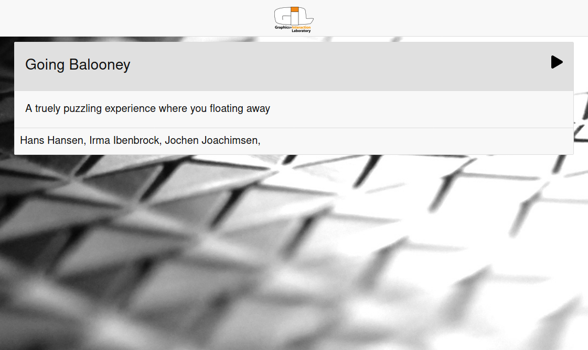

# GIL Launcher

This software is a web-based program launcher written in [Go](https://golang.org). 

## Purpose

We are a small laboratory [Graphics and Interaction Lab](http://graphicsinteractionlab.info) in a university and often asked to run demos for visitors. However, our systems are mainly used for research and teaching. This launcher allows us to go into 'demo-ready' mode within a few seconds'.

## Screenshot

## License

This software is licensed under the terms of the MIT License. Please consult LICENSE.md for terms and conditions.

## Copyright

&copy; Copyright 2020 [Hartmut Seichter](https://technotecture.com)
